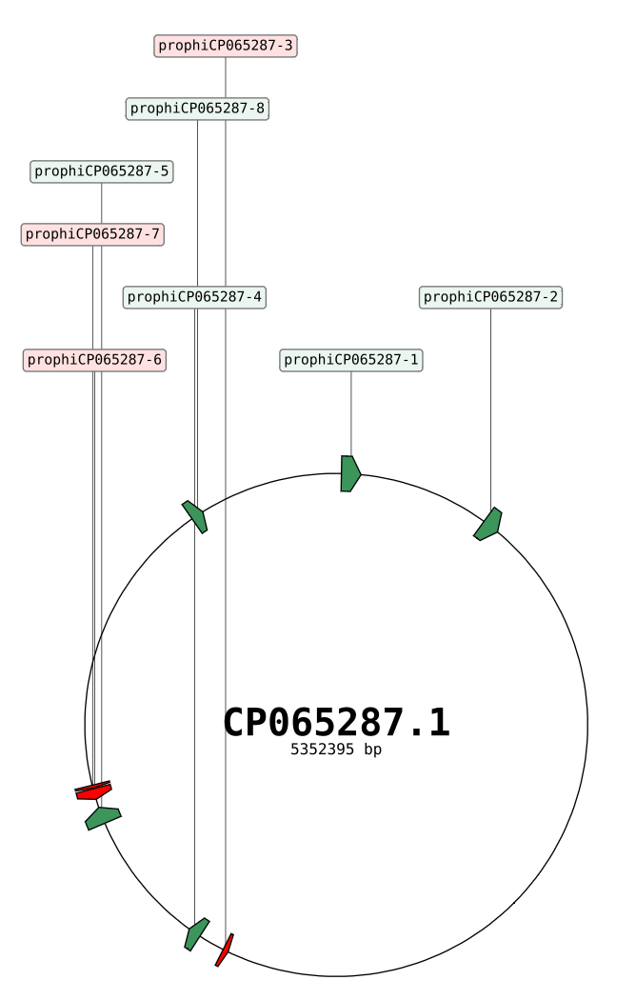
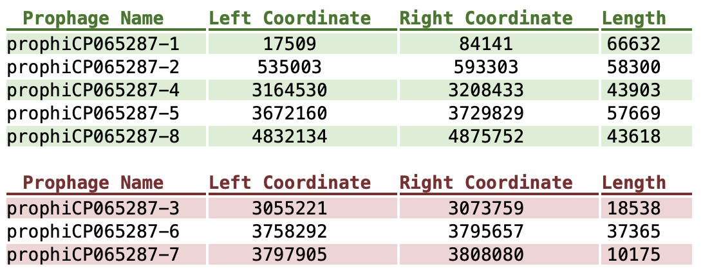
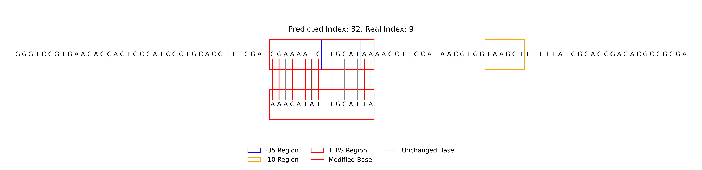

# Engineered Bacteriophage

Engineered Bacteriophage is a project focused on designing engineered phages by identifying phages from bacterial genomes and performing comprehensive genetic modifications. This project provides a complete workflow for phage activation, design, and transformation into engineered phages capable of targeting and eliminating specific bacteria.

## Table of Contents

- [Introduction](#introduction)
- [Features](#features)
- [Prerequisites](#prerequisites)
- [Installation](#installation)
  - [1. Clone the phage_activate Repository](#1-clone-the-phage_activate-repository)
  - [2. Set Up the Environment](#2-set-up-the-environment)
  - [3. Clone the Engineered_bacteriophage Repository](#3-clone-the-engineered_bacteriophage-repository)
  - [4. Download and Install Databases](#4-download-and-install-databases)
- [Directory Structure](#directory-structure)
- [Usage](#usage)
  - [1. Testing the Installation](#1-testing-the-installation)
  - [2. Generating Engineered Bacteriophages](#2-generating-engineered-bacteriophages)
  - [3. Integrated Pipeline](#3-integrated-pipeline)
- [Example Commands](#example-commands)
- [License](#license)
- [Acknowledgements](#acknowledgements)

## Introduction

Phages, or bacteriophages, are viruses that infect and replicate within bacteria. Engineering phages involves modifying their genomes to enhance their ability to target and kill specific bacterial strains, offering a promising alternative to traditional antibiotics. This project streamlines the process of identifying, activating, and engineering phages from bacterial genomes.

## Features

- **Phage Activation**: Identify and activate phages from bacterial genomes.
- **Genetic Engineering**: Modify prophages to create engineered phages with enhanced antibacterial properties.
- **Integrated Pipeline**: A one-stop solution to predict prophages and transform them into engineered phages.
- **Comprehensive Documentation**: Step-by-step guide for installation, setup, and usage.

## Prerequisites

- Python 3.6 or higher
- Git
- pip (Python package installer)
- Access to Google Drive for database downloads

## Installation

### 1. Clone the phage_activate Repository

First, clone the phage_activate repository, which contains the necessary code for phage activation.

```bash
git clone https://github.com/zequanhan/phage_activate.git
cd phage_activate
```

### 2. Set Up the Environment

Install the required dependencies and configure the environment.

```bash
# Install dependencies
pip install -r requirements.txt

# Download the necessary databases as per the repository's instructions
# (Refer to the phage_activate repository for detailed database setup)

# Add phage_design.py to the system PATH
export PATH=$PATH:/path/to/phage_activate/phage_design.py
```

### 3. Clone the Engineered_bacteriophage Repository

Next, clone the main Engineered_bacteriophage repository.

```bash
git clone https://github.com/zequanhan/Engineered_bacteriophage.git
cd Engineered_bacteriophage
```

### 4. Download and Install Databases

Download the required databases from the provided Google Drive link and place them in the specified directories.

#### Download Databases

Access the following Google Drive folder and download:

- [`Mycobacterium.zip`](https://drive.google.com/file/d/1QSi5PCJqNb5zG-ExV0IU57qtkzD9SlJ-/view?usp=drive_link)
- [`db.zip`](https://drive.google.com/file/d/1y7oqzi4li7qif5xziqx-ixPucyZEtIPv/view?usp=drive_link)

#### Extract and Place Databases

```bash
unzip Mycobacterium.zip -d depht/models/Mycobacterium
unzip db.zip -d DBSCAN-SWA/db
```

Ensure the databases are placed in the correct directories as shown below:
```bash
Engineered_bacteriophage/
├── DBSCAN-SWA
│   ├── bin
│   ├── db
│   │   ├── database
│   │   └── profiles
├── depht
│   ├── models
│   │   └── Mycobacterium
├── results
│   ├── depht
│   ├── dpprom_output
│   ├── phage_gene_cluster
│   ├── prokka_genomes
├── scripts
├── Bacteria_to_engineered_bacteriophage.py
├── Integrated_Pipeline.py
└── README.md
```

## Usage

### 1. Testing the Installation

After setting up the environment and installing the databases, verify the installation by checking the help messages of the main scripts.

**Check `Bacteria_to_engineered_bacteriophage.py` Help**

```bash
python scripts/Bacteria_to_engineered_bacteriophage.py -h
```
**Expected Output:**
```bash
  -h, --help            show this help message and exit
  --file_path FILE_PATH
                        输入的GBK文件路径。
  --output_path OUTPUT_PATH
                        输出结果的目录路径
```

**Check `Integrated_Pipeline.py` Help**

```bash
python scripts/Integrated_Pipeline.py -h
```
**Expected Output:**
```bash
  -h, --help            show this help message and exit
  --file_path FILE_PATH
                        输入细菌的GBK文件路径，用于溶源性噬菌体预测。
  --output_path OUTPUT_PATH
                        输出结果的目录路径。
```


### 2. Generating Engineered Bacteriophages

Use the `Bacteria_to_engineered_bacteriophage.py` script to process bacterial genome files and generate engineered phages.

```bash
python scripts/Bacteria_to_engineered_bacteriophage.py --file_path /path/to/input.gbk --output_path /path/to/output_directory
```

### 3. Integrated Pipeline

The `Integrated_Pipeline.py` script allows you to perform prophage prediction and engineering in a single step.

```bash
python scripts/Integrated_Pipeline.py --file_path /path/to/input.gbk --output_path /path/to/output_directory
```

**Pipeline Steps:**

- **Prophage Prediction**: Identifies prophages within the bacterial genome.
- **Phage Engineering**: Modifies identified prophages to create engineered phages.
- **Result Generation**: Outputs engineered phages designed to target and kill the specified bacteria.

## Example Commands

**Example 1: Generate Engineered Phage**

```bash
python scripts/Bacteria_to_engineered_bacteriophage.py --file_path data/input_bacteria.gbk --output_path results/engineered_phage
```



**Example 2: Run Integrated Pipeline**
```bash
python scripts/Integrated_Pipeline.py --file_path data/input_bacteria.gbk --output_path results/integrated_pipeline
```


## License

This project is licensed under the [MIT License](LICENSE).

## Acknowledgements

- [zequanhan](https://github.com/zequanhan) for the [phage_activate](https://github.com/zequanhan/phage_activate/tree/master) and [Engineered_bacteriophage](https://github.com/zequanhan/Engineered_bacteriophage) repositories.
- Open-source contributors and the scientific community for their invaluable resources and support.

